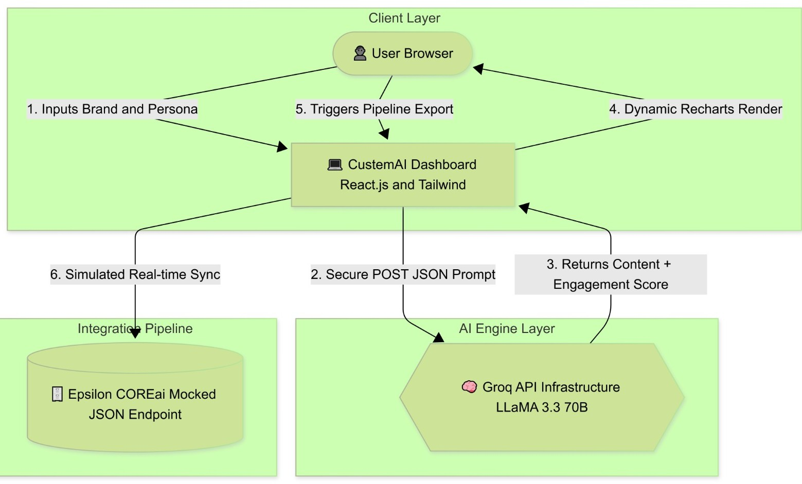

# CustεmAI 🚀

**Hyper-Personalized Marketing at Scale — Built for Epsilon**

CustεmAI is a high-speed AI personalization engine designed to bridge the creative scalability gap in modern marketing. While platforms like Epsilon’s PeopleCloud excel at identifying micro-cohorts, human teams often bottleneck when manually writing hundreds of tailored cross-channel messages. 

CustεmAI acts as the execution layer, instantly translating behavioral signals and persona traits into deployment-ready creative assets (Email, Push, and Display) with dynamically predicted engagement scores.

### 🚀 Features

* **⚡ Low-Latency Inference:** Generates complete, multi-channel marketing payloads in milliseconds using the Groq API and LLaMA 3.3.
* **🎯 Micro-Persona Targeting:** Adapts tone, urgency, and messaging specifically for segmented audiences (e.g., Deal Hunters vs. Loyalty Seekers).
* **📊 Predictive Engagement Scoring:** Evaluates the inherent conversion difficulty of a persona and renders dynamic visual expectations using Recharts.
* **🔗 Pipeline Ready:** One-click mock integration designed to export structured JSON payloads directly into Epsilon's COREai ecosystem.

---

### 🏗️ System Architecture



---

### 🛠️ Architecture Stack

* **Frontend:** React.js, Tailwind CSS, Recharts (Data Visualization)
* **AI Compute Layer:** Groq API (LLaMA 3.3 70B Model)
* **Deployment:** Vercel (Serverless Edge Hosting)

---

### 🏃‍♂️ Run Locally 

Follow these steps to run the application on your local machine. You will need a free API key from [Groq](https://console.groq.com/).

**1. Clone the repository:**
```bash
git clone [https://github.com/Pakhi-308/CustemAI.git](https://github.com/Pakhi-308/CustemAI.git)
cd CustemAI
```

**2. Install dependencies:**
```bash
npm install
```

**3. Configure Environment Variables:**
Create a `.env` file in the root directory and add your Groq API key:
```env
REACT_APP_GROQ_KEY=gsk_your_api_key_here
```

**4. Start the development server:**
```bash
npm start
```
*Open your browser and navigate to: [http://localhost:3000](http://localhost:3000)*

---

### 📡 Live Demo

🔗 [View the Deployed Application Here](https://custem-ai.vercel.app/)  

---

### 👨‍💻 Team: Pakhi's Team

* **Pakhi Shukla** 
* **Kavyansh Vats**
